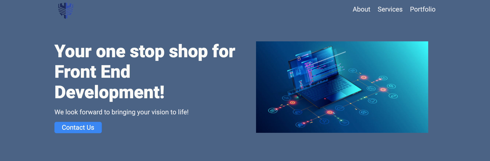
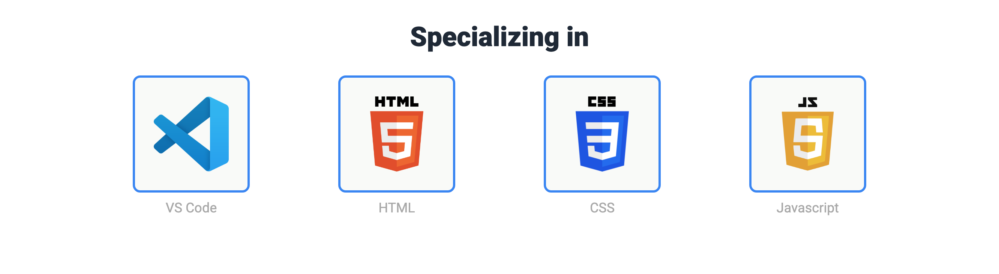
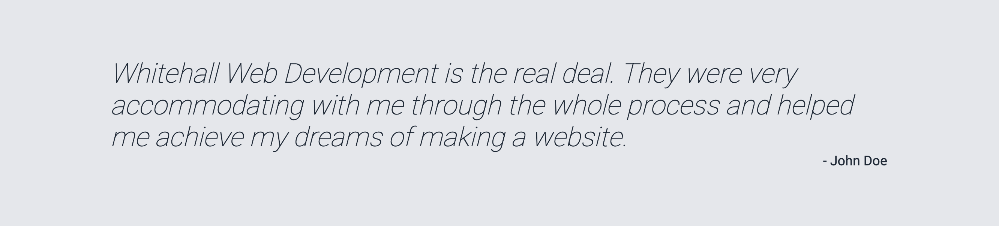
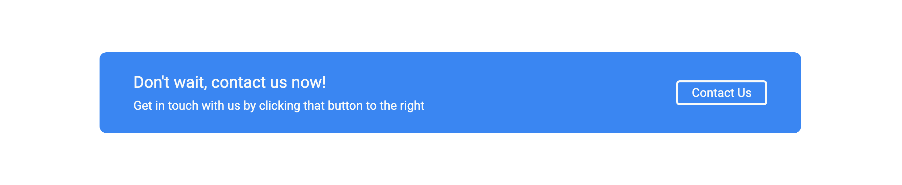

# Landing Page
The goal of this project was to create a simple landing page for a fictional company website using HTML and CSS Flexbox. Now that I've completed the Odin Project I went back and did a further pass on cleaning up the HTML and CSS.

## Features
1. Single page website that has a header with a nav (for decoration).


2. Subheader that contains a mission statement and a contact button (for decoration).
3. The main content starts with a bar of logos for the main topics covered in Odin Foundations.


4. Main content ends with a fictional quote about the company.


5. There is a contact bar at the bottom with another contact button (for decoration).


6. The bottom of the page has a footer with the company name.


## Local Project Setup

1. **Clone the repository**
```git clone https://github.com/thall34/landing-page```
2. **Navigate to the project directory**
```cd clone-location/landing-page```
3. **Open the project in your web browser**
```open index.html```

## Live Link

https://thall34.github.io/landing-page/

## Learning Takeaways
Expanding on the fundamentals taught in the recipes assignment, this further cemented HTML concepts and started diving deep into flexbox concepts.
I had trouble with flexbox at the time, but like anything with more use it became a lot less intimidating.